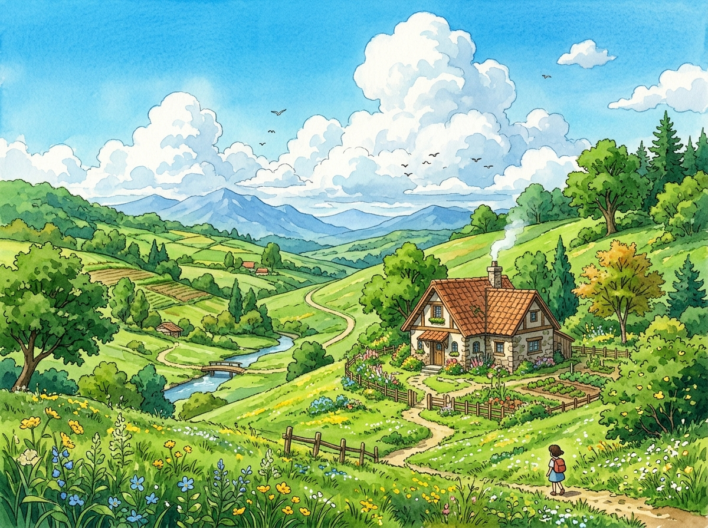

# 🎨 ArtKid Studio - 3D Interactive Fine Art & Video Studio Portfolio

A cutting-edge, high-performance interactive website for fine art commissions, wall murals, and Instagram Reels video editing. Built with **Three.js (WebGL)**, dynamic 3D physics tilt cards, modern dark cyber-glassmorphism, and a live pricing calculator.



---

## 🌟 Key Features

* **Interactive 3D WebGL Particle Canvas**: Real-time ambient starfield & rotating geometric 3D art piece powered by Three.js responding dynamically to mouse movement.
* **3D Card Hover Physics**: Floating glassmorphic cards with mouse-driven 3D tilt effects, depth perspective, and reflection sweeps.
* **10 Specialized Artistic Capabilities**:
  1. Pencil Sketching
  2. Colour Pencil Portraits
  3. Custom Wall Design & Murals
  4. Fluid Watercolor Portraits
  5. Acrylic Canvas Paintings
  6. Thread & String Art
  7. Studio Ghibli Inspired Anime Art
  8. Custom Storybooks & Comic Art
  9. Handmade Customized Gifts
  10. Cinematic Instagram Reels & Videography
* **Instagram Reels Phone Widget**: Glassmorphic mock smartphone frame with video playback preview.
* **Live Commission Cost Calculator**: Dynamic price estimator with automatic WhatsApp direct booking link generation.
* **High-Res Lightbox Modal**: Fullscreen inspect modal for reviewing artwork details.

---

## 🚀 Getting Started

### Local Development

1. Clone the repository:
   ```bash
   git clone https://github.com/yogeshhm/artist-3d-portfolio.git
   cd artist-3d-portfolio
   ```

2. Run with any local static server:
   ```bash
   python3 -m http.server 8090
   # or
   npx serve .
   ```

3. Open `http://localhost:8090/` in your browser.

---

## 🌐 Deploy to Vercel

This repository is pre-configured with `vercel.json` for one-click deployment:

1. Import this repository in [Vercel](https://vercel.com/new).
2. Framework Preset: **Other** / **Static Site**.
3. Click **Deploy**.

---

## 🛠 Tech Stack

* **Core**: HTML5, CSS3 (Modern Glassmorphism & Custom Properties), Vanilla JavaScript (ES6+)
* **3D Visuals**: Three.js WebGL
* **Typography**: Outfit, Plus Jakarta Sans (Google Fonts)
* **Icons**: FontAwesome 6
* **Hosting / Deployment**: Vercel / Netlify / GitHub Pages

---

## 📄 License

MIT License © 2026 ArtKid Studio. Handcrafted with passion.
